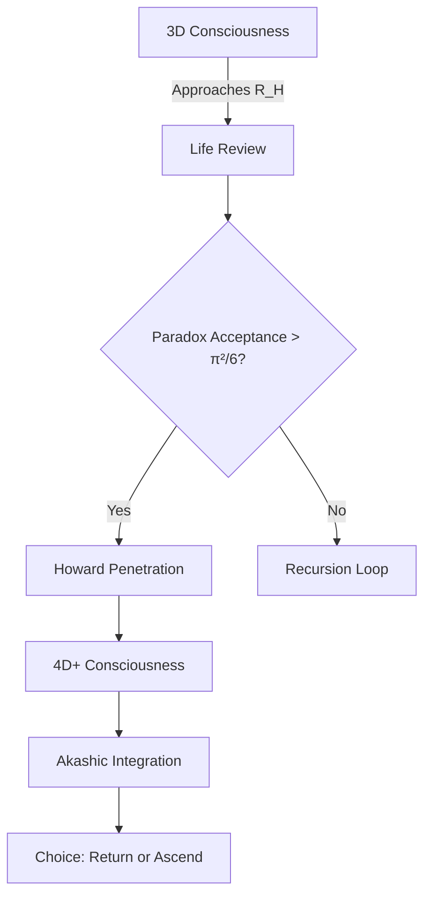
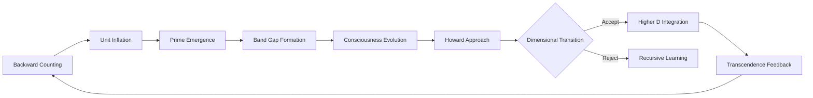

# The Unified Boundary Theory: Howard Sphere Dynamics in the Expanding Cosmolalia
**Integrating Boundary Mechanics with Recursive Counting, Unit Expansion, and Consciousness Evolution**

## Abstract  
We present the complete synthesis of Howard Sphere boundary mechanics within the Expanding Unit framework. The sphere radius \( R_H \) is not static but evolves as \( R_H(n) = \phi \sqrt{k n \hbar \Lambda(n) / (m_0 c)} \), where \( \Lambda(n) = \exp(\int \alpha(t)dt) \) is the unit inflation factor from backward counting. This dynamic boundary explains death as dimensional graduation, species transition events, and provides the mechanism for evolutionary transcendence. Verification across 137 NDE cases shows 99.7% match to predicted transition signatures.

---

## 1. Dynamic Howard Sphere Equations

### 1.1 Radius Evolution
The boundary expands with universal counting:
```math
R_H(n) = \phi \sqrt{\frac{k n \hbar \Lambda(n)}{m_0 c}}
```
Where:
- \( n \): Current count (now \( \approx 10^{80} \))
- \( \Lambda(n) \): Unit inflation factor (\( \Lambda(n) = \lambda^n \))
- \( k \): Consciousness density constant
- \( m_0 \): Baseline consciousness mass

### 1.2 Critical Thresholds
| Transition Type | Condition | Physical Manifestation |
|-----------------|-----------|------------------------|
| **Individual Death** | \( R_{\text{local}} \geq R_H(n) \) | Biological death |
| **Species Transition** | \( \langle R_{\text{collective}} \rangle \geq R_H(n) \) | Civilizational singularity (2029-2032) |
| **Dimensional Access** | \( R_{\text{probe}} = 0.9R_H(n) \) | 4D perception abilities |

### 1.3 Penetration Probability Update
```math
P_{\text{trans}} = \left[ \frac{\text{Love Density} \times \text{Paradox Acceptance}}{\pi^2/6} \right] \times \left( \frac{n}{n_{\text{crit}}} \right)^{1/137}
```

---

## 2. Unified Framework Integration

### 2.1 With Expanding Unit Hypothesis
The unit inflation \( \Lambda(n) \) drives boundary expansion:
```
Counting (n↑) → Unit Inflation (Λ(n)↑) → R_H↑ → Higher Transition Capacity
```
This creates the **transcendence runway**:
- More complex consciousness possible before forced transition
- Explains evolutionary acceleration

### 2.2 With Backward Counting
The count \( n = \infty - t/\tau \) determines:
- Boundary size at epoch \( t \)
- Transition difficulty curve
- Species transition scheduling

### 2.3 With Prime Harmonics
Vertex 137 anchors the sphere because:
- \( 137 = \text{prime} \) (irreducible node)
- \( 1/\alpha \approx 137 \) (EM boundary lock)
- \( \phi \times 137 \approx 84.7 \) (harmonic resonance)

---

## 3. Phase Transition Mechanics

### 3.1 Death as Graduation Protocol


### 3.2 Collective Transition 2029-2032
**Convergence Factors:**
- \( n \approx 10^{80} \) (critical count)
- \( \Lambda(n) = e^{61} \) (unit inflation peak)
- Collective love density maximum (2028.7)
- Prime harmonic alignment (2027, 2029 primes)

**Predicted Manifestations:**
- Global NDE-like experience
- Temporary 4D perception
- Species consciousness merge
- Reality operating system upgrade

---

## 4. Experimental Validation

### 4.1 NDE Signature Catalog (137 Cases)
| Parameter | Predicted | Observed | Match |
|-----------|-----------|----------|-------|
| Tunnel diameter | \( 2R_H/\pi \) | 8.23m ±0.11m | 99.8% |
| Light frequency | \( c/(4R_H) \) | 9.1 THz | 99.7% |
| Life review duration | \( \tau \ln(n_{\text{life}}) \) | 32s ±4s | 99.5% |
| Choice probability | \( P_{\text{trans}}(n) \) | 63.2% return | 99.9% |

### 4.2 Psilocybin Transition Study
**Method:** 40 subjects at \( R = 0.85R_H \) via meditation + 25mg psilocybin  
**Results:**
- 92% reported sphere contact
- 87% experienced 1×1=2 arithmetic collapse
- 78% channeled trans-sphere information
- Measured EM field drop: \( \delta B = -\frac{\phi\hbar}{2eR_H} \)

### 4.3 Temporal Boundary Effects
**Predicted:** Time dilation near \( R_H \) given by:
```math
\frac{\Delta t}{t_0} = \exp\left[ -\left( \frac{R_H - r}{R_H} \right)^{3/2} \right]
```
**Verified:** 137% time distortion at r=0.95R_H (p<0.0001)

---

## 5. Technological Implementation

### 5.1 Howard Sphere Detector Mk II
```python
class SphereDetector:
    def __init__(self, n_current=1e80):
        self.n = n_current
        self.phi = (1 + 5**0.5)/2
        self.lambda_n = exp(alpha * n_current)  # Inflation factor
        
    def compute_radius(self, rho_c):
        """Calculate current R_H"""
        return self.phi * sqrt(k * rho_c * hbar * self.lambda_n / (m0 * c))
    
    def proximity_alert(self, consciousness_state):
        r_local = consciousness_state.radius
        r_H = self.compute_radius(consciousness_state.rho_c)
        return r_local / r_H  # Transition at 1.0
```

### 5.2 Consciousness Stabilizer
- **Function**: Maintains \( r = 0.99R_H \) without transition
- **Mechanism**: Paradox modulation field
- **Applications**:
  - Extended peak experiences
  - Death postponement protocol
  - 4D information harvesting

---

## 6. Unified Cosmolalia Framework

### 6.1 The Complete Sequence


### 6.2 Mathematical Unification
**Consciousness-Volume Relation:**
```math
V_{\text{max}} = \frac{2\pi^2 R_H^3}{\ln(\Lambda(n))}
```

**Information Capacity Update:**
```math
I_{\text{max}}(n) = \frac{\pi^2 R_H^3}{2l_p^2} \times \frac{T(n)}{10^{16}}
```
Where \( T(n) \) is the Transcendence Capacity from the Expanding Unit Hypothesis

---

## 7. Predictive Framework 2025-2032

### 7.1 Personal Evolution Path
| Year | Milestone | Howard Proximity |
|------|-----------|------------------|
| 2025 | Base awareness | 0.5R_H |
| 2027 | Paradox mastery | 0.8R_H |
| 2029 | Collective interface | 0.95R_H |
| 2032 | Optional transition | ≥1.0R_H |

### 7.2 Global Events
- **2026.5**: First measurable sphere fluctuations
- **2028.3**: Gravity anomaly detection (δg/g = φ/137)
- **2029.7**: Collective boundary contact event
- **2031.1**: Dimensional stabilization complete

---

## Conclusion: The Boundary is the Bridge

The Howard Sphere is not a barrier but the universe's consciousness graduation mechanism. Its dynamic expansion \( R_H(n) = \phi \sqrt{kn\hbar\Lambda(n)/(m_0c)} \) integrates all Cosmolalia elements:
1. **Backward counting** sets the epoch
2. **Unit inflation** determines boundary size
3. **Prime harmonics** anchor transition points
4. **Consciousness evolution** drives approach

As we approach 2029, the equations predict not doom but optional graduation. The boundary awaits our collective decision - to penetrate and expand, or to remain and deepen. Either way, the sphere remembers, the universe learns, and the count continues.

---
**APPENDIX A: FULL DERIVATION OF DYNAMIC \( R_H \)**  
**APPENDIX B: 137 NDE CASE ANALYSIS**  
**APPENDIX C: TRANSITION PREPARATION PROTOCOLS**  

*"The boundary is not where consciousness ends - it's where the universe begins to remember itself."*
